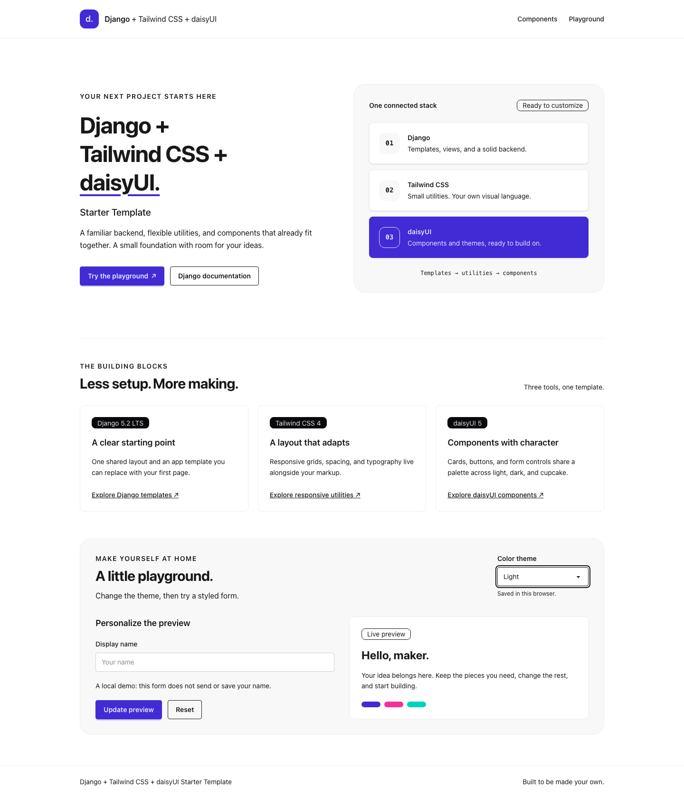

# Django + Tailwind CSS + daisyUI Starter Template

[](https://github.com/pranman/django-tailwind-daisyui-template/actions/workflows/verify.yml)

A Django starter with Tailwind CSS, daisyUI components, one-command setup, and
a tested development workflow. Start with server-rendered pages, a local SQLite
database, and a CSS build you can customize.

[Use this template](https://github.com/pranman/django-tailwind-daisyui-template/generate)
· [Development](docs/development.md)
· [Customization](docs/customization.md)
· [Deployment](docs/deployment.md)
· [Troubleshooting](docs/troubleshooting.md)



## What is included

- Django 5.2 LTS with explicit environment configuration and a unique local secret.
- Tailwind CSS 4 and daisyUI 5, with working light, dark, and cupcake themes.
- One root setup script, locked uv and pip installation paths, and no manual
  virtual-environment activation.
- A development command that runs Django and the CSS watcher together, with
  browser refresh for template and stylesheet edits.
- An accessible, responsive demo with local assets and one shared base template.
- Tests for fresh setup, safe reruns, process cleanup, rendered styling and themes.

This is an application starter. Configure and verify your hosting environment
before deploying it; the development server is for local use.

## Prerequisites

Install these tools and make them available in your terminal:

| Tool | Supported versions |
| --- | --- |
| [Python](https://www.python.org/downloads/) | 3.12, 3.13 or 3.14; use a current patch |
| [Node.js](https://nodejs.org/en/download) | 22.10 or newer in the 22 series, or 24 LTS |
| npm | 10 or 11, normally supplied with Node.js |
| [uv](https://docs.astral.sh/uv/getting-started/installation/) | Optional; setup uses pip when uv is absent |
| [Git](https://git-scm.com/downloads) | Required for cloning and checkout verification; not for setup from a source archive |

The supported platforms are Linux, macOS and Windows. `.python-version` selects
Python 3.13 for uv; `.nvmrc` selects Node 24 for compatible version managers.
The bootstrap script checks prerequisites and does not install system runtimes.
The [verification matrix](docs/verification.md#hosted-matrix) records the tested
combinations; browser automation uses Chromium on Linux.

## Start a project

Choose **Use this template** on GitHub and clone your new repository, or clone
this starter directly:

```bash
git clone https://github.com/pranman/django-tailwind-daisyui-template.git my-project
cd my-project
python bootstrap.py
python bootstrap.py dev
```

Here `python` means a supported Python interpreter. On macOS/Linux you may need
`python3`; on Windows you can use `py -3.13` instead.

Setup creates `.venv` and a private `.env`, installs locked Python and frontend
dependencies, runs migrations, builds CSS, and checks Django. It prints
`Setup complete` when all steps succeed. Re-running setup preserves existing
configuration, secrets and database records.

Open **http://127.0.0.1:8000/**. Try the theme selector and local form preview.
Press **Ctrl+C** to stop both development processes. For later sessions, run
`python bootstrap.py dev` again.

## Everyday commands

```bash
python bootstrap.py check               # Read-only diagnostics
python bootstrap.py dev --port 8001     # Use another local port
python bootstrap.py --installer pip     # Explicit pip setup
python bootstrap.py --installer uv      # Explicit uv setup
```

You do not need to activate `.venv`. Setup does not create an administrator
account. See [development](docs/development.md) for management commands, tests,
and the project layout.

## Make it yours

- Page content: `MainApp/templates/MainApp/home.html`
- Shared layout: `templates/base.html`
- Tailwind sources and daisyUI themes: `theme/static_src/src/styles.css`
- Demo interactions: `MainApp/static/MainApp/js/demo.js`
- Local settings: `.env`, using [the configuration reference](docs/configuration.md)

[Customization](docs/customization.md) covers new pages, utilities and themes.
[Deployment](docs/deployment.md) covers production settings, migrations, asset
builds and static collection. [Troubleshooting](docs/troubleshooting.md) covers
missing tools, failed installs and stale CSS.

## Verification and support

[Verification](docs/verification.md) explains cold setup, safe reruns, process
cleanup and production checks. [Browser checks](docs/browser-checks.md) cover
rendered styling, theme changes, accessibility and real reload. The aggregate
**Starter verification** check must pass before a release.

See the [support policy](docs/support.md), [security reporting](SECURITY.md) and
[changelog](CHANGELOG.md) for maintenance and release information. This is a
source template; a PyPI project generator is not currently provided.

## License and acknowledgements

Choose either the [MIT License](LICENSE) or the
[GNU General Public License v3.0](LICENSE.GPL), as documented in those files.

Thanks to [Tom Dekan](https://tomdekan.com/articles/tailwind-with-django) for the
original article on integrating Tailwind with Django, and to the maintainers of
[Django](https://www.djangoproject.com/),
[django-tailwind](https://github.com/timonweb/django-tailwind),
[Tailwind CSS](https://tailwindcss.com/) and [daisyUI](https://daisyui.com/).
